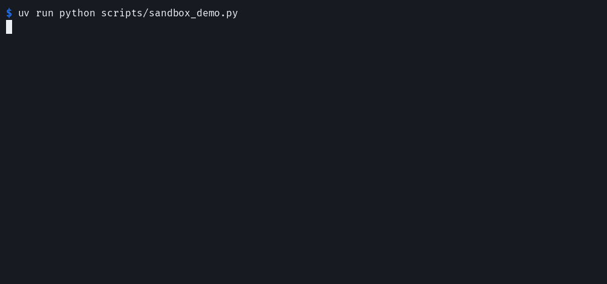
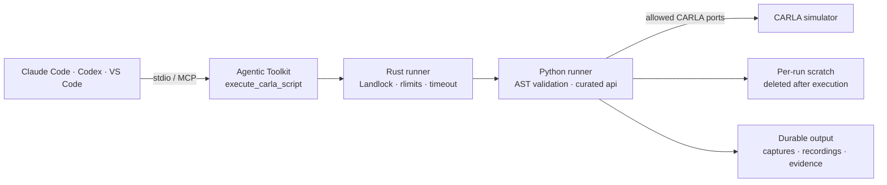

<!-- markdownlint-disable MD033 -->
<p align="center">
  
</p>

<div align="center">

<h1>CARLA Agentic Toolkit</h1>

<h3>Sandboxed, composable control for the CARLA autonomous-driving simulator.</h3>

<p>
  <a href="#quick-start"></a>
  <a href="docs/client-setup.md"></a>
  <a href="SECURITY.md"></a>
</p>

<p>
  <a href="https://github.com/sidkolapalli/carla-mcp/actions/workflows/ci.yml"></a>
  
  
  
  
  <a href="LICENSE"></a>
</p>

<p>
  <a href="#overview">Overview</a> ·
  <a href="#demo">Demo</a> ·
  <a href="#quick-start">Quick start</a> ·
  <a href="#capabilities">Capabilities</a> ·
  <a href="#security-model">Security</a> ·
  <a href="#contributing">Contributing</a>
</p>

</div>
<!-- markdownlint-enable MD033 -->

The CARLA Agentic Toolkit gives local AI coding agents a constrained path into
[CARLA](https://github.com/carla-simulator/carla). Instead of exposing dozens of
small tools, it provides one composable tool—`execute_carla_script`—that runs a
complete Python workflow against a curated CARLA API.

Agent-authored code is validated, launched through a Rust subprocess, restricted
with Linux Landlock, and given a dedicated place for durable captures,
recordings, and evidence.

> [!IMPORTANT]
> The CARLA Agentic Toolkit is an experimental, local, Linux-hosted community
> project. Windows clients run it inside WSL2. It is not affiliated with or
> endorsed by CARLA, and it is not a production multi-user security boundary.

## Overview

- **One tool, complete workflows.** Combine world inspection, traffic,
  sensors, navigation, recording, and evidence handling in a single script.
- **A CARLA-shaped API.** Agents work through an explicit, documented surface
  instead of unrestricted access to the CARLA Python package.
- **Containment at the process boundary.** A Rust runner applies Landlock,
  resource limits, a cleared environment, and timeout cleanup before Python
  starts.
- **Useful outputs survive.** Per-run scratch space is disposable; requested
  captures and evidence remain in a dedicated output directory.
- **Current MCP, practical compatibility.** The same stdio server supports the
  stateless MCP `2026-07-28` revision and 2025-era local clients.

## Demo

<!-- markdownlint-disable MD033 -->
<p align="center">
  
</p>

<p align="center">
  <em>A real sandbox walkthrough. No running CARLA server required.</em>
</p>
<!-- markdownlint-enable MD033 -->

Reproduce the demo locally:

```bash
uv run python scripts/sandbox_demo.py
```

It executes real scripts, confirms Landlock enforcement, rejects access outside
the curated API, cleans per-run scratch space, and verifies that durable
evidence remains available.

## Quick Start

### Requirements

- Linux with Landlock ABI V7, or Windows 11 with a WSL2 kernel that provides it
- Python 3.12, [uv](https://docs.astral.sh/uv/), and a Rust toolchain
- A CARLA Python API version matching a reachable CARLA server

New to CARLA or WSL2? Read the **[prerequisites and platform
layout](docs/client-setup.md#prerequisites)** before continuing.

### 1. Prepare the Toolkit

```bash
git clone https://github.com/sidkolapalli/carla-mcp.git
cd carla-mcp
uv sync --locked --python 3.12

# Replace 0.9.16 if your simulator uses another version.
uv pip install --python .venv "carla==0.9.16"
cargo build --locked --manifest-path sandbox-runner/Cargo.toml --release

export CARLA_MCP_HOME="$(pwd)"
export CARLA_MCP_OUTPUT_DIR="$HOME/carla-mcp-output"
export UV_BIN="$(command -v uv)"
mkdir -p "$CARLA_MCP_OUTPUT_DIR"
```

### 2. Connect an MCP Client

#### Claude Code

```bash
claude mcp add --scope local --transport stdio carla \
  -e "CARLA_MCP_OUTPUT_DIR=$CARLA_MCP_OUTPUT_DIR" -- \
  "$UV_BIN" --directory "$CARLA_MCP_HOME" run carla-mcp

claude mcp list
```

#### OpenAI Codex

```bash
codex mcp add carla --env "CARLA_MCP_OUTPUT_DIR=$CARLA_MCP_OUTPUT_DIR" -- \
  "$UV_BIN" --directory "$CARLA_MCP_HOME" run carla-mcp

codex mcp list
```

For VS Code configuration, Claude scopes, Codex timeout and approval settings,
preflight checks, and troubleshooting, see the **[Client Setup
Guide](docs/client-setup.md)**.

Windows 11 users run the complete server and Rust/Landlock sandbox inside WSL2
through `carla-mcp-windows`; follow the Windows setup in the client guide.

### 3. Send the First Request

Start CARLA, then ask your client:

> Use the CARLA Agentic Toolkit to run `api.health_check()` and summarize the
> connected version, map, and actor counts without changing the simulation.

The tool is marked destructive and open-world, so clients normally request
approval unless local policy explicitly allows it.

## One Tool, Complete Workflows

Scripts receive a curated `api` object and return a JSON-compatible value by
assigning it to `result`:

```python
health = api.health_check()
world = api.get_world_state()

result = {
    "connected": health["connected"],
    "map": world["current_map"],
    "actors": world["actor_counts"],
}
```

Call `api.describe_api()` inside a script for the live method catalog. This
keeps discovery next to execution and lets an agent compose a workflow without
round-tripping through a large collection of narrow tools.

Recoverable CARLA operation failures return a script value with `ok: false`,
`error_type`, and `message`. Script rejection, uncaught exceptions, runner
failures, and timeouts fail the complete MCP call with `isError: true` while
retaining the structured diagnostics.

## Capabilities

| Control surface | Examples |
| --- | --- |
| Diagnostics and world | Connection health, maps, settings, deterministic ticks |
| Actors and traffic | Spawning, autopilot, density, behavior profiles |
| Sensors and perception | Cameras, LIDAR, radar, IMU, GNSS, captures |
| Vehicles and pedestrians | Vehicle controls, telemetry, walker movement |
| Scene and navigation | Weather, lights, waypoints, routes, topology |
| Recording and evidence | Record, replay, queries, captures, evidence manifests |

## How It Works



The public MCP surface stays deliberately small. Complexity lives behind that
boundary: script validation, process isolation, CARLA adaptation, traffic
control, and output lifecycle management remain implementation details.

## Security Model

The CARLA Agentic Toolkit uses defense in depth around model-authored Python:

| Layer | What it enforces |
| --- | --- |
| MCP contract | One tool, structured output, and destructive/open-world annotations for client approval |
| Rust subprocess | Environment clearing, resource limits, timeout handling, and process-tree cleanup |
| Landlock | Read-only runtime paths, write access only to scratch/output, and allowed TCP ports |
| Python validation | No imports, unsafe builtins, private attributes, or string-format traversal |
| Curated CARLA API | Scripts reach supported operations through the injected `api` object |

Execution fails closed when the Rust runner is missing or Landlock cannot fully
enforce every requested rule. Landlock restricts TCP ports rather than
destination hosts, so connect only to trusted CARLA hosts.

Read **[SECURITY.md](SECURITY.md)** for the supported threat model, deployment
assumptions, and private vulnerability reporting process.

## Client Support

| Client environment | Status |
| --- | --- |
| Claude Code on Linux | Supported through stdio |
| OpenAI Codex CLI/IDE on Linux | Supported through stdio |
| VS Code on Linux | Supported through stdio |
| Windows 11 clients | Experimental through `carla-mcp-windows` and WSL2 |
| macOS or WSL1 | Unsupported; the runner requires Linux Landlock |
| Web or cloud agents | Unsupported; requires an authenticated HTTP deployment |

## Current Boundaries

- Source checkout only; the Python wheel does not yet bundle the Rust runner.
- Local stdio only; there is no authenticated remote transport.
- Windows support uses WSL2; there is no weaker native Windows sandbox fallback.
- Traffic controller state lasts for one script process. Keep that script alive
  with `api.wait()` or use the live sidecar.
- Automated tests use mock CARLA adapters. Live simulator validation remains a
  manual gate.

Relative output paths such as `captures/front.png` are rooted in
`CARLA_MCP_OUTPUT_DIR`. Per-run scratch space is deleted after every script.

## Development

Run the complete local quality gate:

```bash
make check
```

It runs Ruff, Ty, Radon, Rustfmt, Clippy, Rust tests, and pytest—including real
Landlock and stdio integration checks. GitHub Actions runs the same gate and
builds the Python distributions.

With CARLA running locally:

```bash
uv run python scripts/live_smoke.py --reset-existing --vehicle-count 12
```

Use `--keep-running` to keep the sidecar Traffic Manager client alive.

## Documentation

| Guide | Contents |
| --- | --- |
| [Client setup](docs/client-setup.md) | Client configuration, preflight checks, and troubleshooting |
| [CARLA support surface](docs/carla-support-surface.md) | Researched simulator operations and coverage |
| [MCP migration review](docs/mcp-2026-07-28.md) | Protocol revision and compatibility decisions |
| [Security policy](SECURITY.md) | Threat model and vulnerability reporting |
| [Contributing guide](CONTRIBUTING.md) | Development workflow and contribution standards |
| [Code of Conduct](CODE_OF_CONDUCT.md) | Community expectations |

## Contributing

Contributions are welcome. Read **[CONTRIBUTING.md](CONTRIBUTING.md)**, follow
the **[Code of Conduct](CODE_OF_CONDUCT.md)**, and open an issue before starting
a large behavioral change.

## Acknowledgements

The CARLA Agentic Toolkit builds on the
[CARLA simulator](https://github.com/carla-simulator/carla), the
[Model Context Protocol](https://modelcontextprotocol.io/), the
[MCP Python SDK](https://github.com/modelcontextprotocol/python-sdk),
[Landlock](https://landlock.io/), and [uv](https://docs.astral.sh/uv/).
Thanks to the maintainers and communities behind them.

## License

[MIT](LICENSE) © 2026 Siddharth Kolapalli.
