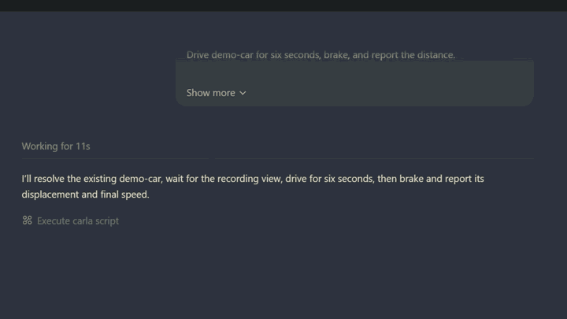
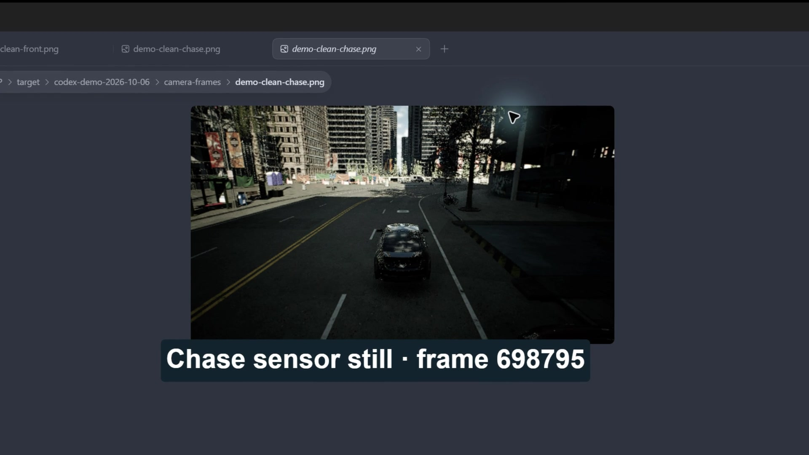
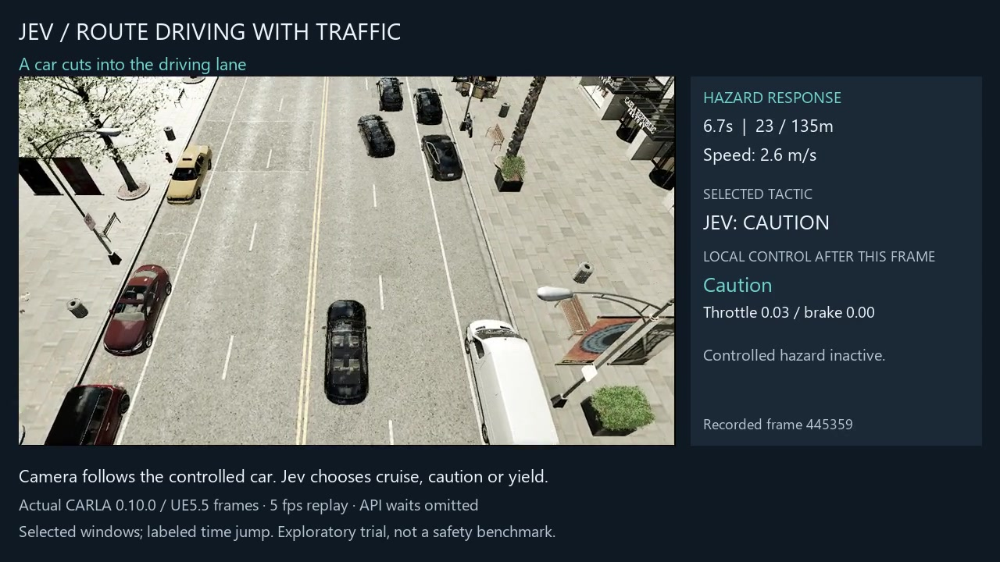

<div align="center">

# CARLA Agentic Toolkit

**Control CARLA with plain English.**<br>
**Explore System One decisions with Jev.**

Connect **Codex, Claude Code, or VS Code** to [CARLA](https://github.com/carla-simulator/carla), the open-source driving simulator.<br>
Build scenes, drive cars, and bring **real images, measurements, and saved results** back to your agent.

[](https://github.com/sidkolapalli/carla-agentic-toolkit/actions/workflows/ci.yml)
[](LICENSE)
[](docs/alpha-release-notes.md)

**[Watch demos](#demo)** &nbsp; · &nbsp; **[Get started](#quick-start)** &nbsp; · &nbsp; **[System One + Jev](#system-one-decisions-with-jev)** &nbsp; · &nbsp; **[Documentation](#documentation)**

Local Linux / WSL2 · Separate CARLA installation required · Jev optional

> Community project, not affiliated with or endorsed by CARLA, TypeSafe, or the featured coding-agent providers.

</div>

## Demo

### Ask Codex. Watch the car move.

> Drive demo-car for six seconds, brake, and report the distance.

<p align="center">
  
  <br><sub>Scene credit: <a href="docs/assets/readme/README.md">docs/assets/readme/README.md</a></sub>
</p>

<details>
<summary><strong>Play the full drive demo · 47 seconds</strong></summary>

https://github.com/user-attachments/assets/2d9712dc-3e64-4e0c-b905-f31241eaeda0

</details>

Codex drives the prepared car, brakes, and reports **18.75 m of displacement
including stopping**. The animation above skips between excerpts; the full
Recordly edit shows the prompt, labeled 8× agent work, and driving at 1× speed.

| See through the car's cameras | System One in action with Jev |
| --- | --- |
|  |  |
| **[Watch · 37 seconds](https://github.com/user-attachments/assets/a3b3001c-5793-45de-bc6d-b84e142cdfad)** — Codex retrieves real front and chase sensor images, then removes its cameras. | **[Watch · 80 seconds](https://github.com/user-attachments/assets/2749e704-e5ab-4de7-9a24-bb70a2bd3442)** — Jev selects `cruise`, `caution`, or `yield` along a 135 m route with controlled traffic. |

<details>
<summary>Play the camera demo · 37 seconds</summary>

https://github.com/user-attachments/assets/a3b3001c-5793-45de-bc6d-b84e142cdfad

</details>

<details>
<summary>Play the Jev System One route demo · 80 seconds</summary>

https://github.com/user-attachments/assets/2749e704-e5ab-4de7-9a24-bb70a2bd3442

</details>

The Codex demos use a configured simulator and an already named car; they do
not use Jev. The camera views are captured stills. The Jev video samples recorded
frames and omits waiting; **its attempted pedestrian crossing was not achieved**.
These are demonstrations of the workflows, not safety or response-time benchmarks.
[Codex recording details](docs/evidence/codex-demos-2026-10-06/README.md) ·
[Route results and limitations](docs/evidence/route-hazards-2026-10-05/README.md)

## Why use it?

**One tool handles the whole workflow:** set up the scene, act, observe, and
measure. Your agent writes the Python workflow; the toolkit runs it through a
constrained API and a Linux sandbox.

- **Go from a request to a complete experiment.** Your agent can combine scene
  setup, vehicle control, sensors, and measurement in one Python workflow through
  `execute_carla_script`.
- **Study System One decisions in a simulator.** Compare Jev's driving tactics
  with a no-key rules policy under the same vehicle controller. Inspect the
  recorded decisions, fallbacks, and route outcomes to see where each works.
- **See what actually happened.** Return camera images directly to your agent,
  inspect measurements, and keep captures and experiment traces after a run.
- **Give generated code a defined boundary.** The curated API, Rust runner, and
  Linux Landlock sandbox constrain execution. Timeouts and failed scripts trigger
  owned-actor cleanup; successful scripts can keep the scene for follow-up requests.

## System One decisions with Jev

**[Jev, TypeSafe's System One model](https://typesafe.ai/blog/introducing-system-one-models-and-jev),
returns structured decisions that software can act on.** Here, it selects from
allowed driving tactics using the current simulator state: when to merge,
cruise, slow down, or yield. The coding agent handles your conversation and writes
workflows; Jev supplies the optional tactical decisions inside reviewed experiments.

| Component | What it does |
| --- | --- |
| Codex / Claude Code / VS Code agent | Turns your request into a simulation workflow. |
| Toolkit | Runs agent scripts through the sandbox; manages experiment timing, validation, evidence, and cleanup. |
| Jev, when enabled | Reads structured observations and selects from supplied tactics. |
| Local controller | Converts the accepted tactic into steering, throttle, and braking; applies guards and fallbacks. |
| CARLA | Simulates the road, vehicles, traffic, physics, and sensors. |

Jev uses numerical simulator state in this integration; it does not interpret
camera images or directly command the pedals. The ordinary MCP workflows and
rules baseline need no Jev key. Jev experiments require the optional SDK and
`TYPESAFE_API_KEY` in the trusted process environment.

**Explore:** [Run a rules/Jev comparison](docs/managed-experiments.md) ·
[Follow a route with traffic](docs/route-experiments.md) ·
[See six analytical graphs](docs/evidence/route-study-2026-10-05/README.md) ·
[Watch a merge and budget fallback · 40 seconds](docs/evidence/managed-demo-2026-10-03/README.md)

## Quick start

> [!IMPORTANT]
> **You need a running CARLA simulator and a supported Linux environment.**
> The toolkit requires Landlock ABI V7, Python 3.12,
> [uv](https://docs.astral.sh/uv/), and Rust.
> The CARLA server and Python client must match.

| Your setup | Start here |
| --- | --- |
| Linux, building from source | Follow the commands below. |
| Windows 11 | Use the [WSL2 setup guide](docs/client-setup.md#windows-11-with-wsl2); the sandbox runs inside Linux. |
| Docker | Use the [packaged MCP server guide](docs/client-setup.md#docker-mcp-server); CARLA runs separately. |
| CARLA 0.10.0 / UE5 | Read the [matching-client setup and experimental limits](docs/client-setup.md#carla-release-compatibility) before installing. |

### 1. Install and check the sandbox

This example uses **CARLA 0.9.16** on Linux. For a different simulator version,
install its matching Python API; UE5 needs the wheel described in the guide above.

```bash
git clone https://github.com/sidkolapalli/carla-agentic-toolkit.git
cd carla-agentic-toolkit
uv sync --locked --python 3.12
uv pip install --python .venv "carla==0.9.16"
cargo build --locked --manifest-path sandbox-runner/Cargo.toml --release

export CARLA_AGENTIC_TOOLKIT_HOME="$(pwd)"
export CARLA_AGENTIC_TOOLKIT_OUTPUT_DIR="$HOME/carla-agentic-toolkit-output"
export UV_BIN="$(command -v uv)"
mkdir -p "$CARLA_AGENTIC_TOOLKIT_OUTPUT_DIR"

uv run --no-sync carla-agentic-toolkit-preflight
```

Continue when preflight reports **`ok: true`** and **`ruleset_enforced: true`**.
The Python wheel alone does not include the Rust runner.

### 2. Connect your agent

For Codex on Linux, run in the same shell:

```bash
codex mcp add carla --env "CARLA_AGENTIC_TOOLKIT_OUTPUT_DIR=$CARLA_AGENTIC_TOOLKIT_OUTPUT_DIR" -- \
  "$UV_BIN" --directory "$CARLA_AGENTIC_TOOLKIT_HOME" run --no-sync carla-agentic-toolkit
codex mcp list
```

[Claude Code setup](docs/client-setup.md#2-claude-code) ·
[VS Code setup](docs/client-setup.md#4-vs-code) ·
[Codex settings and timeouts](docs/client-setup.md#3-openai-codex)

### 3. Check the connection, then try a workflow

With CARLA running, send this first request. Include your simulator's host and
RPC port if they differ from `127.0.0.1:2000`.

> Use the CARLA toolkit to check the connection. Tell me the simulator version,
> map, and actor counts without changing the world.

Once connected, try this in a dedicated simulation:

> Spawn one car at an available spawn point and name it demo-car. Capture a front
> camera image and show it to me. Remove the camera when you're done, and leave
> the car parked for my next request.

Your client may ask you to approve simulator operations. For a scripted check
with measured results and cleanup, follow the [reproducible demo](docs/alpha-demo.md).

## What to expect today

This is an **experimental local toolkit** for building and studying simulation
workflows. It does not establish autonomous-driving safety or production reliability.

- **CARLA 0.9.16 / UE4:** retained live validation with a matching client and server.
- **CARLA 0.10.0 / UE5:** scoped live validation, including the Codex demos above;
  some features differ or are unavailable. See the [UE5 findings](docs/evidence/ue5-validation-2026-10-05/README.md).
- **Local clients:** Linux or Windows through WSL2. Native macOS, native Windows
  execution, and a hosted remote service are not supported.
- **Isolation:** intended for trusted local use, with a [documented security
  boundary](SECURITY.md). It is not a multi-user hosting service.

See the [alpha release notes](docs/alpha-release-notes.md) for known issues and
the [script workflow guide](docs/script-workflows.md) for cleanup, timing, and output behavior.

## Documentation

| I want to… | Guide |
| --- | --- |
| Install, connect a client, or troubleshoot | [Client setup](docs/client-setup.md) |
| Understand scripts, images, saved outputs, and cleanup | [Script workflows](docs/script-workflows.md) |
| Keep state across requests | [Persistent script sessions](docs/persistent-sessions.md) |
| Work with synchronous sensors | [Sensor timing](docs/sensor-timing.md) |
| Run and compare driving experiments | [Managed experiments](docs/managed-experiments.md) and [route experiments](docs/route-experiments.md) |
| Inspect decisions and reproduce results | [Experiment evidence](docs/experiment-evidence.md) and [managed architecture](docs/managed-architecture.md) |
| Report a vulnerability privately | [Security policy](SECURITY.md) |

## Contributing

Help improve the workflows, CARLA compatibility, tests, or documentation. Start
with [CONTRIBUTING.md](CONTRIBUTING.md) and the [GitFlow guide](docs/gitflow.md):
ordinary contributions branch from and open PRs into `develop`; `main` tracks
released work. Follow the [Code of Conduct](CODE_OF_CONDUCT.md).

## License and credits

[MIT](LICENSE) © 2026 Siddharth Kolapalli. Built on
[CARLA](https://github.com/carla-simulator/carla),
[MCP](https://modelcontextprotocol.io/), and [Landlock](https://landlock.io/).
CARLA code is MIT and CARLA assets are CC-BY; scene credits are in
[docs/assets/readme/README.md](docs/assets/readme/README.md) and each evidence
README. Recorded CARLA scenes retain the asset licenses and attribution linked
with each demo.
