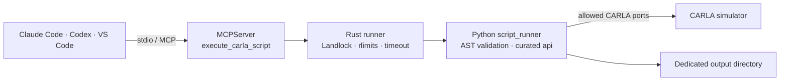

<!-- markdownlint-disable MD033 -->
<h1 align="center">CARLA MCP</h1>

<p align="center">
  <strong>Sandboxed agent control for the CARLA autonomous-driving simulator.</strong>
</p>

<p align="center">
  
  
  
  
  <a href="LICENSE"></a>
</p>
<!-- markdownlint-enable MD033 -->

CARLA MCP gives Claude Code, OpenAI Codex, VS Code, and other local MCP clients
one composable tool—`execute_carla_script`—backed by a curated CARLA API and a
fail-closed Linux Landlock sandbox.

> [!IMPORTANT]
> This is an experimental, local, Linux-only community project. It is not
> affiliated with or endorsed by CARLA, and it is not a production multi-user
> security boundary.

## Demo

<!-- markdownlint-disable MD033 -->
<p align="center">
  
</p>

<p align="center">
  <em>Real sandbox walkthrough; no running CARLA server required.</em>
</p>
<!-- markdownlint-enable MD033 -->

Reproduce it with `uv run python scripts/sandbox_demo.py`. The walkthrough runs
real scripts, confirms Landlock enforcement, rejects access outside the curated
API, and verifies that evidence survives per-run scratch cleanup.

## Why This Exists

- **Compose workflows instead of juggling dozens of tools.** Agents combine
  world, traffic, sensor, navigation, and recording operations in one script.
- **Contain model-authored code.** A Rust subprocess runner applies Landlock,
  resource limits, environment clearing, timeout cleanup, and restricted CARLA
  TCP ports before Python starts.
- **Use current MCP without abandoning existing clients.** MCP Python SDK 2.0
  serves the stateless `2026-07-28` revision and 2025-era clients from the same
  stdio server.

## Capabilities

| Area | Examples |
| --- | --- |
| Diagnostics and world | Health, maps, settings, deterministic ticks |
| Actors and traffic | Spawning, autopilot, density, behavior profiles |
| Sensors and perception | Cameras, LIDAR, radar, IMU, GNSS, captures |
| Vehicles and pedestrians | Controls, telemetry, walkers |
| Scene and navigation | Weather, lights, waypoints, routes, topology |
| Recording and evidence | Record, replay, queries, evidence manifests |

Call `api.describe_api()` inside a script for the live method catalog.

## How It Works



Scripts receive `api`, compose operations, and assign their final value to
`result`:

```python
health = api.health_check()
world = api.get_world_state()
result = {
    "connected": health["connected"],
    "map": world["current_map"],
    "actors": world["actor_counts"],
}
```

## Quick Start

### Requirements

- Linux with the Landlock features requested by the runner
- Python 3.12+, [uv](https://docs.astral.sh/uv/), and a Rust toolchain
- A CARLA Python API version matching a reachable CARLA server

```bash
git clone https://github.com/sidkolapalli/carla-mcp.git
cd carla-mcp
uv sync --locked
# Install the matching CARLA Python API into this .venv.
cargo build --locked --manifest-path sandbox-runner/Cargo.toml --release

export CARLA_MCP_HOME="$(pwd)"
export CARLA_MCP_OUTPUT_DIR="$HOME/carla-mcp-output"
export UV_BIN="$(command -v uv)"
mkdir -p "$CARLA_MCP_OUTPUT_DIR"
```

### Claude Code

```bash
claude mcp add --scope local --transport stdio carla \
  -e "CARLA_MCP_OUTPUT_DIR=$CARLA_MCP_OUTPUT_DIR" -- \
  "$UV_BIN" --directory "$CARLA_MCP_HOME" run carla-mcp

claude mcp list
```

### OpenAI Codex

```bash
codex mcp add carla --env "CARLA_MCP_OUTPUT_DIR=$CARLA_MCP_OUTPUT_DIR" -- \
  "$UV_BIN" --directory "$CARLA_MCP_HOME" run carla-mcp

codex mcp list
```

See **[Client Setup](docs/client-setup.md)** for Claude scopes, Codex timeout and
approval settings, VS Code configuration, platform support, preflight checks,
and troubleshooting.

Once CARLA is running, try:

> Use CARLA MCP to run `api.health_check()` and summarize the connected version,
> map, and actor counts without changing the simulation.

## Security Model

Script execution fails closed when the Rust runner is missing or Landlock cannot
fully enforce every requested rule. The child receives read access to required
project/runtime paths, write access only to per-run scratch and
`CARLA_MCP_OUTPUT_DIR`, and TCP access only on configured CARLA and Traffic
Manager port numbers. Landlock restricts ports rather than destination hosts, so
use only trusted CARLA hosts.

AST validation rejects imports, unsafe builtins, string-format traversal, and
private attributes as defense in depth. See [SECURITY.md](SECURITY.md) for the
supported threat model and private reporting process.

## Current Boundaries

- Source checkout only; the Python wheel does not yet bundle the Rust runner.
- Local stdio only; cloud/web clients require a future authenticated HTTP
  deployment.
- Traffic controller state lasts for one script process; keep that script alive
  with `api.wait()` or use the live sidecar.
- Automated tests use mock CARLA adapters. Live simulator validation remains a
  manual gate.

Relative output paths such as `captures/front.png` are rooted in
`CARLA_MCP_OUTPUT_DIR`. Per-run scratch space is deleted after every script.

## Development

```bash
make check
```

The gate runs Ruff, Ty, Radon, Rustfmt, Clippy with warnings denied, and pytest.
GitHub Actions runs the same gate and builds the Python distributions.

With CARLA running locally:

```bash
uv run python scripts/live_smoke.py --reset-existing --vehicle-count 12
```

Use `--keep-running` to keep the sidecar Traffic Manager client alive.

## Project

- [Client setup](docs/client-setup.md)
- [MCP 2026-07-28 migration review](docs/mcp-2026-07-28.md)
- [CARLA support-surface research](docs/carla-support-surface.md)
- [Contributing](CONTRIBUTING.md)
- [Security policy](SECURITY.md)
- [Code of Conduct](CODE_OF_CONDUCT.md)

## License

[MIT](LICENSE) © 2026 Siddharth Kolapalli.
