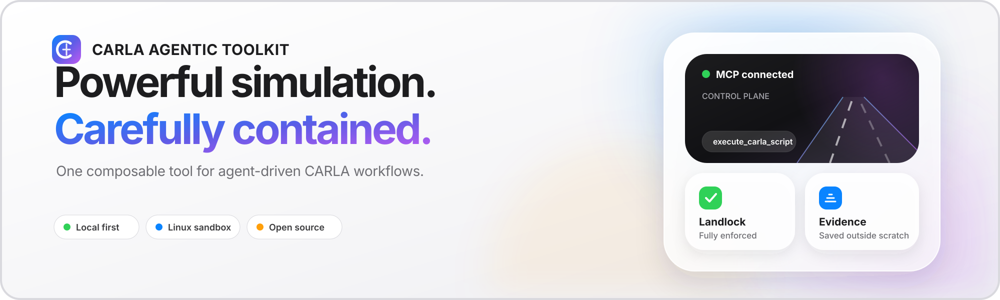
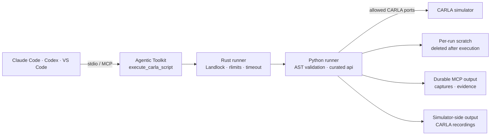

<!-- markdownlint-disable MD033 -->
<p align="center">
  
</p>

<div align="center">

<h1>CARLA Agentic Toolkit</h1>

<h3>Sandboxed, composable control for the CARLA autonomous-driving simulator.</h3>

<p>
  <a href="#quick-start"></a>
  <a href="docs/client-setup.md"></a>
  <a href="SECURITY.md"></a>
</p>

<p>
  <a href="https://github.com/sidkolapalli/carla-agentic-toolkit/actions/workflows/ci.yml"></a>
  
  
  
  
  <a href="LICENSE"></a>
</p>

<p>
  <a href="#overview">Overview</a> ·
  <a href="#demo">Demo</a> ·
  <a href="#quick-start">Quick start</a> ·
  <a href="#capabilities">Capabilities</a> ·
  <a href="#security-model">Security</a> ·
  <a href="#contributing">Contributing</a>
</p>

</div>
<!-- markdownlint-enable MD033 -->

The CARLA Agentic Toolkit gives local AI coding agents a constrained path into
[CARLA](https://github.com/carla-simulator/carla). Instead of exposing dozens of
small tools, its default interface provides one composable tool,
`execute_carla_script`, that runs a complete Python workflow against a curated
CARLA API. Optional managed experiments add bounded start/status/stop/result
controls for a reviewed merge fixture.

Agent-authored code is validated, launched through a Rust subprocess, restricted
with Linux Landlock, and given a dedicated place for durable captures,
recordings, and evidence.

> [!IMPORTANT]
> The CARLA Agentic Toolkit is an experimental, local, Linux-hosted community
> project. Windows clients run it inside WSL2. It is not affiliated with or
> endorsed by CARLA, and it is not a production multi-user security boundary.

## Overview

- **One tool, complete workflows.** Combine world inspection, traffic,
  sensors, navigation, recording, and evidence handling in a single script.
- **A CARLA-shaped API.** Agents work through an explicit, documented surface
  instead of unrestricted access to the CARLA Python package.
- **Containment at the process boundary.** A Rust runner applies Landlock,
  resource limits, a cleared environment, and timeout cleanup before Python
  starts.
- **Useful outputs survive.** Per-run scratch space is disposable; requested
  captures and evidence remain in a dedicated output directory.
- **Current MCP, practical compatibility.** The same stdio server supports the
  stateless MCP `2026-07-28` revision and 2025-era local clients.
- **Opt-in managed experiments.** Run a no-key rules baseline, or select bounded
  maneuvers with Jev, while a trusted supervisor owns timing, cleanup, and traces.

## Demo

### Recorded managed experiment

Watch the [40-second CARLA/Jev demonstration](docs/evidence/managed-demo-2026-10-03/README.md)
with frame-linked decisions, a completed merge, and a deliberate budget fallback
that ends with an incomplete maneuver and verified cleanup. A
[fresh independent automated reproduction](docs/evidence/independent-reproduction-2026-10-03/README.md)
also completed all six declared rules/Jev trials using the published instructions.
These are experimental results; neither a recording nor six trials establishes
production reliability or safety.

### Live workflow

A self-cleaning MCP smoke test exercises the complete public path: it spawns and
follows a vehicle, changes the weather, measures acceleration, returns a native
MCP image, restores simulator state, and verifies that no actors remain.

```bash
uv run python scripts/live_mcp_smoke.py --confirm-live --host 127.0.0.1 --port 2000
```

### Sandbox walkthrough

Run the real sandbox walkthrough without a CARLA server:

```bash
uv run python scripts/sandbox_demo.py
```

This no-simulator demo confirms Landlock enforcement, rejects access outside the
curated API, cleans per-run scratch space, and verifies that durable evidence
remains available.

## Quick Start

### Requirements

- Linux with Landlock ABI V7, or Windows 11 with a WSL2 kernel that provides it
- Docker, or Python 3.12 plus [uv](https://docs.astral.sh/uv/) and Rust
- A CARLA Python API version matching a reachable CARLA server

New to CARLA or WSL2? Read the **[prerequisites and platform
layout](docs/client-setup.md#prerequisites)** before continuing.

### Docker: packaged MCP server

CARLA stays native so its GPU-rendered window remains visible. Docker packages
only the MCP server, matching CARLA Python API, and Rust/Landlock sandbox:

The runtime image is headless and contains no shell or package manager. Invoke
installed commands directly. The default image excludes the optional Jev SDK;
use the source setup below for Jev experiments.

```bash
docker build --build-arg CARLA_VERSION=0.9.16 -t carla-agentic-toolkit .
docker volume create carla-agentic-toolkit-output

docker run --rm --read-only --security-opt=no-new-privileges \
  --tmpfs /tmp:rw,nosuid,nodev,size=64m \
  --mount source=carla-agentic-toolkit-output,target=/output \
  carla-agentic-toolkit carla-agentic-toolkit-preflight
```

The preflight must report `"ruleset_enforced": true`. Then configure an MCP
client to run this stdio command:

```bash
docker run --rm -i --read-only --security-opt=no-new-privileges \
  --tmpfs /tmp:rw,nosuid,nodev,size=64m \
  --add-host=host.docker.internal:host-gateway \
  --mount source=carla-agentic-toolkit-output,target=/output carla-agentic-toolkit
```

Tell the agent to use `host.docker.internal` and your CARLA RPC port in tool
calls. See the **[Docker client configurations](docs/client-setup.md#docker-mcp-server)**.

### 1. Prepare the Toolkit from source

```bash
git clone https://github.com/sidkolapalli/carla-agentic-toolkit.git
cd carla-agentic-toolkit
uv sync --locked --python 3.12

# Replace 0.9.16 if your simulator uses another version.
uv pip install --python .venv "carla==0.9.16"
cargo build --locked --manifest-path sandbox-runner/Cargo.toml --release

export CARLA_AGENTIC_TOOLKIT_HOME="$(pwd)"
export CARLA_AGENTIC_TOOLKIT_OUTPUT_DIR="$HOME/carla-agentic-toolkit-output"
export UV_BIN="$(command -v uv)"
mkdir -p "$CARLA_AGENTIC_TOOLKIT_OUTPUT_DIR"
```

### 2. Connect an MCP Client

#### Claude Code

```bash
claude mcp add --scope local --transport stdio carla \
  -e "CARLA_AGENTIC_TOOLKIT_OUTPUT_DIR=$CARLA_AGENTIC_TOOLKIT_OUTPUT_DIR" -- \
  "$UV_BIN" --directory "$CARLA_AGENTIC_TOOLKIT_HOME" run carla-agentic-toolkit

claude mcp list
```

#### OpenAI Codex

```bash
codex mcp add carla --env "CARLA_AGENTIC_TOOLKIT_OUTPUT_DIR=$CARLA_AGENTIC_TOOLKIT_OUTPUT_DIR" -- \
  "$UV_BIN" --directory "$CARLA_AGENTIC_TOOLKIT_HOME" run carla-agentic-toolkit

codex mcp list
```

For VS Code configuration, Claude scopes, Codex timeout and approval settings,
preflight checks, and troubleshooting, see the **[Client Setup
Guide](docs/client-setup.md)**.

Windows 11 users run the complete server and Rust/Landlock sandbox inside WSL2
through `carla-agentic-toolkit-windows`; follow the Windows setup in the client guide.

### 3. Send the First Request

Start CARLA, then ask your client:

> Use the CARLA Agentic Toolkit to run `api.health_check()` and summarize the
> connected version, map, and actor counts without changing the simulation.

The tool is marked destructive and open-world, so clients normally request
approval unless local policy explicitly allows it.

## One Tool, Complete Workflows

Scripts receive a curated `api` object and return a JSON-compatible value by
assigning it to `result`:

```python
health = api.health_check()
world = api.get_world_state()

result = {
    "connected": health["connected"],
    "map": world["current_map"],
    "actors": world["actor_counts"],
}
```

Call `api.describe_api()` inside a script for the live method catalog. This
keeps discovery next to execution and lets an agent compose a workflow without
round-tripping through a large collection of narrow tools.

Recoverable CARLA operation failures return a script value with `ok: false`,
`error_type`, and `error`. Check that value before depending on an operation's
result. Script rejection, uncaught exceptions, runner
failures, and timeouts fail the complete MCP call with `isError: true` while
retaining the structured diagnostics.

Each result also contains inline `snapshots` keyed by `carla-snapshot://...`.
They exist only for that script run and are not advertised as live MCP
Resources. Files under `CARLA_AGENTIC_TOOLKIT_OUTPUT_DIR` may persist after the call. In
v0.1 this is a breaking rename from the former `resources` field; no
compatibility alias is emitted.

A script can explicitly return a durable camera frame as native MCP image
content in an asynchronous world:

```python
capture = api.capture_sensor_frame(sensor_id, "captures/front.png", publish=True)
result = {"capture": capture}
```

Published PNG/JPEG captures include both `ImageContent` for vision-capable
clients and a `carla-output://capture/...` Resource link for later reads. JSON
text remains first for clients that ignore visual content. Publication is
limited to four images, 512 KiB each, and a 1 MiB combined encoded result; paths
must resolve below `CARLA_AGENTIC_TOOLKIT_OUTPUT_DIR`.

Synchronous sensors use `subscribe_sensor` → owner `tick` → `drain_sensor` →
`close_sensor_subscription`. Bounded queues report delayed and dropped frames;
empty collision-event drains do not wait. Population/autopilot requests accept
`advance_world=False`, and batch operations accept `do_tick=False` when a caller
owns the clock. See [sensor timing and advancement](docs/sensor-timing.md).

Actors can keep conversational names across calls:

```python
api.name_actor("ego", actor_id)
ego_id = api.resolve_actor("ego")["actor_id"]
```

Aliases are stored under `CARLA_AGENTIC_TOOLKIT_OUTPUT_DIR`, isolated by CARLA host and
port, and survive server restarts that reuse that directory. `resolve_actor()`
checks the live simulator and removes stale aliases; names are a convenience,
not an authorization boundary. Use `api.list_named_actors()` and
`api.forget_actor()` to manage them.

## Managed Merge Experiment

The managed CLI runs a reviewed numerical specification in a trusted worker.
It creates one independently controlled ego and one merging vehicle on a
verified Town10HD corridor. It uses range-filtered simulator ground truth;
it does not model realistic occlusion or claim to know another driver's intent.
Use a dedicated CARLA instance with Town10HD loaded and no existing vehicles,
walkers, sensors, or walker controllers.

After the source setup above, run the no-key baseline:

```bash
uv run --no-sync carla-agentic-toolkit-experiment run \
  --spec docs/examples/merge-rules-v1.json
```

The example connects to `127.0.0.1:2000`; edit its `host` and `port` for your
simulator, including the Windows host address when using WSL NAT. It needs no
Traffic Manager sidecar. JSON output reports the run ID, termination, cleanup,
outcome, and paths to private JSONL evidence, summary JSON, and a static HTML
report. A completed maneuver and verified cleanup are separate fields.

Use `start` to return promptly, followed by `status`, `stop`, or `result` with
the returned run ID. `stop` requests cancellation; inspect `terminated` and
`cleanup.ok` before starting another owner. Managed MCP controls are disabled
by default. Set `CARLA_AGENTIC_TOOLKIT_MANAGED_EXPERIMENTS=1` in the trusted
server environment to expose `managed_experiment` with the same lifecycle.

Jev is optional: install `uv sync --locked --extra jev --python 3.12`, reinstall
the matching CARLA Python API if needed, and supply `TYPESAFE_API_KEY` only in
the trusted process environment. Then use `docs/examples/merge-jev-v1.json`.
Numerical candidates, controllers, constraints, and cleanup remain shared with
the rules run. Provider failures and stale replies produce recorded fallbacks.
The [managed experiment guide](docs/managed-experiments.md) covers exact setup,
timing modes, limits, ownership, replay restrictions, and matched comparisons.

Set `CARLA_AGENTIC_TOOLKIT_ENABLE_SCRIPT_SESSIONS=1` to add the opt-in
`carla_script_session` lifecycle tool for a persistent sandboxed namespace,
owned-vehicle telemetry, bounded deadlines, and cleanup. See
[persistent script sessions](docs/persistent-sessions.md).

## Capabilities

| Control surface | Examples |
| --- | --- |
| Diagnostics and world | Connection health, maps, settings, deterministic ticks |
| Actors and traffic | Spawning, autopilot, density, behavior profiles, per-vehicle TM routes/tuning |
| Actor physics | Physics/gravity toggles, impulse/force/torque, angular velocity, bounded vehicle physics |
| Sensors and perception | Cameras, LIDAR, radar, IMU, GNSS, captures |
| Vehicles and pedestrians | Vehicle controls, telemetry, walker movement |
| Scene and navigation | Weather, semantic tags/bounds, filtered landmarks, routes, map layers, bounded OpenDRIVE |
| Recording and evidence | Record, replay, queries, captures, evidence manifests |
| Managed experiments (opt-in) | Rules/Jev selection, strict offline replay, local lifecycle controls, protected actors, continuous traces |
| Persistent scripts (opt-in) | Retained namespace, asynchronous requests, owned-vehicle telemetry, cancellation and cleanup |

## How It Works



The public MCP surface stays deliberately small. Complexity lives behind that
boundary: script validation, process isolation, CARLA adaptation, traffic
control, and output lifecycle management remain implementation details.

## Security Model

The CARLA Agentic Toolkit uses defense in depth around model-authored Python:

| Layer | What it enforces |
| --- | --- |
| MCP contract | Default script tool, explicit lifecycle opt-ins, structured output, and destructive/open-world annotations |
| Rust subprocess | Environment clearing, resource limits, timeout handling, and process-tree cleanup |
| Landlock | Read-only runtime paths, write access only to scratch/output, and allowed TCP ports |
| Python validation | No imports, unsafe builtins, private attributes, or string-format traversal |
| Curated CARLA API | Scripts reach supported operations through the injected `api` object |

Execution fails closed when the Rust runner is missing or Landlock cannot fully
enforce every requested rule. Landlock restricts TCP ports rather than
destination hosts, so connect only to trusted CARLA hosts.

Read **[SECURITY.md](SECURITY.md)** for the supported threat model, deployment
assumptions, and private vulnerability reporting process.

## Client Support

| Client environment | Status |
| --- | --- |
| Claude Code on Linux | Supported through stdio |
| OpenAI Codex CLI/IDE on Linux | Supported through stdio |
| VS Code on Linux | Supported through stdio |
| Windows 11 clients | Experimental through `carla-agentic-toolkit-windows` and WSL2 |
| macOS or WSL1 | Unsupported; the runner requires Linux Landlock |
| Web or cloud agents | Unsupported; requires an authenticated HTTP deployment |

## Current Boundaries

- Use the Docker image or a source checkout; the Python wheel does not yet bundle
  the Rust runner.
- Local stdio only; there is no authenticated remote transport.
- One MCP server serializes complete script executions against shared simulator
  state. `timeout_seconds` starts after queueing and covers sandbox execution,
  not time spent waiting for that lock.
- Cooperating local scripts and managed workers also share a simulator lease
  through private state. Use the same state directory for every local process.
  This cannot prevent an unrelated CARLA client from changing the world.
- Actors created through the curated API are journaled per execution. Uncaught
  exceptions and timeouts trigger best-effort CARLA-side cleanup without touching
  pre-existing actors. Successful runs keep their actors unless the script calls
  `api.cleanup_owned_actors()` or explicit destroy methods.
- Windows support uses WSL2; there is no weaker native Windows sandbox fallback.
- Map-layer streaming and OpenDRIVE generation are destructive simulator operations.
  CARLA builds or maps may expose these methods yet fail while streaming; use a
  dedicated simulator and verify health afterward. Runtime capability probes
  avoid version assumptions but cannot guarantee an engine operation will succeed.
- Traffic controller state lasts for one script process. Keep that script alive
  with `api.wait()` or use the live sidecar. Autopilot and traffic tuning require
  an existing Traffic Manager server in a trusted client outside the sandbox;
  see [Traffic Manager setup](docs/client-setup.md#traffic-manager).
- Background density is supported in asynchronous worlds. Synchronous density
  maintenance and non-ticking recorder replay fail explicitly before mutation.
- Managed experiments accept validated data, not arbitrary scripts or provider
  URLs. They require dedicated-instance ownership and retain private evidence.
- Automated tests include deterministic adapters and real sandbox checks. Live
  CARLA and configured provider integration remain separate validation gates.

Relative capture and evidence paths such as `captures/front.png` are rooted in
`CARLA_AGENTIC_TOOLKIT_OUTPUT_DIR`. Recorder paths are opened by the CARLA simulator host;
set `CARLA_AGENTIC_TOOLKIT_RECORDER_DIR` to an absolute directory understood by that host.
The toolkit reports CARLA's accepted path and does not copy recorder files
between hosts. Per-run scratch space is deleted after every script.

## Development

Run the complete local quality gate:

```bash
make check
```

It runs Ruff, Ty, Radon, Rustfmt, Clippy, Rust tests, and pytest—including real
Landlock and stdio integration checks. GitHub Actions runs the same gate and
builds the Python distributions.

With CARLA running locally:

```bash
uv run python scripts/live_smoke.py --reset-existing --vehicle-count 12
```

Use `--keep-running` to keep the sidecar Traffic Manager client alive.

For an explicit, self-cleaning test through MCP stdio itself:

```bash
uv run python scripts/live_mcp_smoke.py --confirm-live --host 127.0.0.1 --port 2000
```

Add `--windows` to launch through `carla-agentic-toolkit-windows`. The harness tags and
removes only its own vehicle, detaches its camera, restores weather, and emits
one JSON report. Never run it against a shared simulator without permission.

## Documentation

| Guide | Contents |
| --- | --- |
| [Client setup](docs/client-setup.md) | Client configuration, preflight checks, and troubleshooting |
| [Managed experiments](docs/managed-experiments.md) | No-key baseline, optional Jev, lifecycle, limits, and comparison procedure |
| [Managed architecture](docs/managed-architecture.md) | Ownership, timing, decisions, recovery, and evidence invariants |
| [Release readiness](docs/release-readiness.md) | Candidate evidence and remaining acceptance/publication gates |
| [Alpha release notes](docs/alpha-release-notes.md) | Source-only changes, supported workflows, and known limitations |
| [Alpha demo guide](docs/alpha-demo.md) | Reproducible installation, successful live run, and failure checks |
| [Persistent script sessions](docs/persistent-sessions.md) | Retained namespaces, requests, telemetry, ownership, and cancellation |
| [Sensor timing](docs/sensor-timing.md) | Subscribe/tick/drain/close, bounded delivery, and non-ticking mutations |
| [Experiment evidence](docs/experiment-evidence.md) | Trace schema, physical metrics, private retention, and exact replay |
| [Security policy](SECURITY.md) | Threat model and vulnerability reporting |
| [Contributing guide](CONTRIBUTING.md) | Development workflow and contribution standards |
| [Code of Conduct](CODE_OF_CONDUCT.md) | Community expectations |

## Contributing

Contributions are welcome. Read **[CONTRIBUTING.md](CONTRIBUTING.md)**, follow
the **[Code of Conduct](CODE_OF_CONDUCT.md)**, and open an issue before starting
a large behavioral change.

## Acknowledgements

The CARLA Agentic Toolkit builds on the
[CARLA simulator](https://github.com/carla-simulator/carla), the
[Model Context Protocol](https://modelcontextprotocol.io/), the
[MCP Python SDK](https://github.com/modelcontextprotocol/python-sdk),
[Landlock](https://landlock.io/), and [uv](https://docs.astral.sh/uv/).
Thanks to the maintainers and communities behind them.

## License

[MIT](LICENSE) © 2026 Siddharth Kolapalli.
