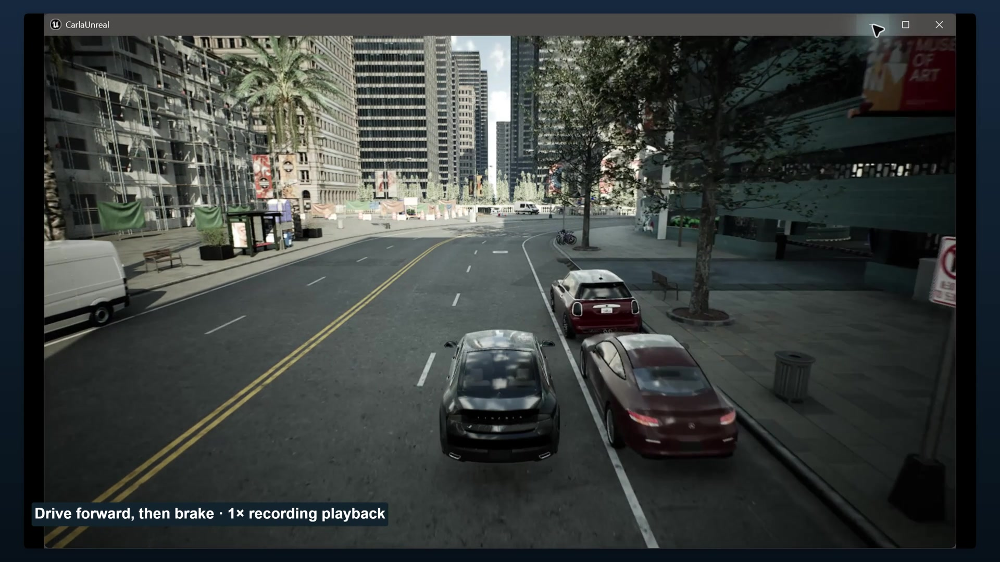

# Ask Codex. Watch CARLA respond.

These two fresh recordings show a real request arriving in Codex, a real
`execute_carla_script` MCP call, and the resulting CARLA vehicle movement or
camera images. CARLA is a driving simulator; this toolkit gives Codex a curated,
sandboxed API for controlling it.

| Drive and stop · 47 seconds | Inspect the cameras · 37 seconds |
| --- | --- |
|  |  |

Both silent 1080p exports passed full decoding and visual review of the scenes,
every-second contact sheets and transitions. The [export manifest](export-manifest.json)
records SHA-256 hashes, original source selections, playback rates and native
Recordly export results.

## Drive, then stop

The opening request is:

> Drive demo-car for six seconds, brake, and report the distance.

Codex resolves the existing Lincoln, applies throttle for six seconds while a
chase camera follows, then brakes. The measured displacement is **15.93m during
the drive and 18.75m including stopping**. These are distances between recorded
3D endpoints, not a continuously sampled trajectory length. A subsequent check
measured 0.00000827m/s and confirmed that the handbrake was engaged.

The car was already parked and named `demo-car`; the simulator connection was
configured before this take. The full initial request also supplied the endpoint,
bounded control instructions and a ten-second wait to switch the recording view.
This is an example of using a prepared local environment.

## Ask for the car's views

In a second fresh Codex chat, the request asks for a front view and a chase view
from the same parked car. Codex attaches one camera at a time and returns the
actual image through MCP. Both images are **640×360**:

| View | Simulator frame | Sensor | Result |
| --- | ---: | ---: | --- |
| [Front image](demo-clean-front.png) | 698091 | 34 | Image returned; camera destroyed |
| [Chase image](demo-clean-chase.png) | 698795 | 35 | Image returned; camera destroyed |

The final call verified that no cameras remained and the car was stationary.
The [image manifest](camera-frames.json) records copies from the simulator's
output directory that match the SHA-256 hashes of the image bytes returned in
the original MCP results. They are simulator
captures, not generated illustrations or replacement scene imagery.

A recorded follow-up opens these saved images in Codex's file preview panel.
The chat reports that the open requests were queued and visibility was not yet
verified; the recording independently shows both previews. The labeled frames
are sensor stills captured at different times, rather than live video.

## How the recordings were made

The owner-authorized recording workflow dispatched the messages into actual
Codex chats. The videos show those messages and actual execution; they do not
claim that a person manually typed the messages on camera. Each published take
uses its own fresh chat so that the request and response remain readable.

The unmodified Windows Graphics Capture helper bundled with
[Recordly 1.4.0](https://github.com/webadderallorg/Recordly/releases/tag/v1.4.0)
captured the real Codex and CARLA windows without microphone or system audio.
The edit uses Recordly's native project, zoom, caption and export features.
Where separate window recordings are joined, FFmpeg assembles the selected
original clips at 4K before Recordly renders the edit. FFmpeg then compresses
the rendered master to 1080p for delivery. No chat messages, tool results,
vehicle motion or camera observations are synthesized.

Working excerpts are labeled **8× playback**; the driving scene stays at **1×**.
Omitted waiting is documented in the source selections. The full source
recordings, capture timing, 4K masters and editable projects remain local.
A short edited demonstration does not
measure agent response latency or establish reliability.

These scenes use **CARLA server and Python client 0.10.0**, Town10HD_Opt and a
Linux/WSL2 toolkit connected to the Windows simulator. They retain the temporary
local streaming relay described in the [UE5 validation](../ue5-validation-2026-10-05/README.md).
The world stays asynchronous. **Jev is not used in either scene**: Codex writes
bounded control or capture scripts, the toolkit validates and runs them, and
CARLA simulates the requested actions. The separate
[Jev experiments](../../route-experiments.md) cover typed tactical choices.

## Evidence and retained rehearsal failures

The [motion receipt](evidence-motion-take.json) and
[camera receipt](evidence-camera-take.json) contain the exact complete requests,
generated scripts, measured results and image hashes. The motion take completed
five CARLA calls and the camera take completed four, with no tool-level failures
in those takes. Raw chat logs, hidden reasoning, thread identifiers, local paths
and credentials are excluded from the sanitized receipts.

The [rehearsal receipt](evidence-chat.json) preserves earlier attempts separately
from these fresh takes. They include an unavailable `dir` builtin, an initial
`name_actor_failed` result followed by a successful retry, an initial throttle
setting that barely moved the car, and three camera-publication attempts that
failed:

- A basename-only capture path triggered an empty-directory creation error.
- A 1280×720 image exceeded the 512KiB per-image publication limit.
- Two 640×360 images together exceeded the 1MiB encoded MCP result limit.

The successful camera workflow uses a relative `captures/` path and one image
per call. The exact historical prompts retain that workaround. The requested
red vehicle appeared dark in the UE5 rendering; a color
request is not evidence that the requested material was displayed. The published
motion take's 18.75m result must not be substituted with the rehearsal's 17.59m
measurement.

The basename capture failure is fixed in this change: native image writers now
receive an absolute output path while returned capture metadata keeps the
requested path. Regression tests first reproduced the failure. The subsequent
[quality checks](quality-checks.json) passed 679 Python and nine Rust tests,
with two documented Python skips. Six real Landlock probes verified allowed
output paths and rejected escapes. The recorded takes precede this fix and
use the documented relative-path workaround; the simulator was not restarted
to claim a new live test of the fix.

After both takes, the [cleanup request and result](evidence-cleanup.json) removed
the car, forgot its alias, and restored the saved spectator transform. Its
measured health result confirmed matching 0.10.0 versions, zero vehicles,
sensors or walkers, and no warnings. The cleanup result reported no missing
unrelated actors; the 23 existing traffic actors remained.

The [independent baseline check](final-world-state.json) then verified that the
original 24 actors, world settings and spectator transform matched the saved
baseline. The [shutdown receipt](shutdown.json) records stopping the simulator
and temporary relay after verification. This separate check is not a replay of
the chat's summary.

## Scene credit

CARLA Simulator contributors, CARLA 0.10.0, Town10HD_Opt. The
[upstream license notice](https://github.com/carla-simulator/carla/blob/0.10.0/README.md#licenses)
identifies CARLA-specific assets as CC-BY. Window capture, clip selection,
letterboxing, zoom and explanatory overlays were produced for this project;
underlying scene assets retain their upstream terms independently of the
toolkit's MIT license. Codex and Recordly interfaces are shown as the tools used
in the workflow. No CARLA, OpenAI or Recordly endorsement is implied.
