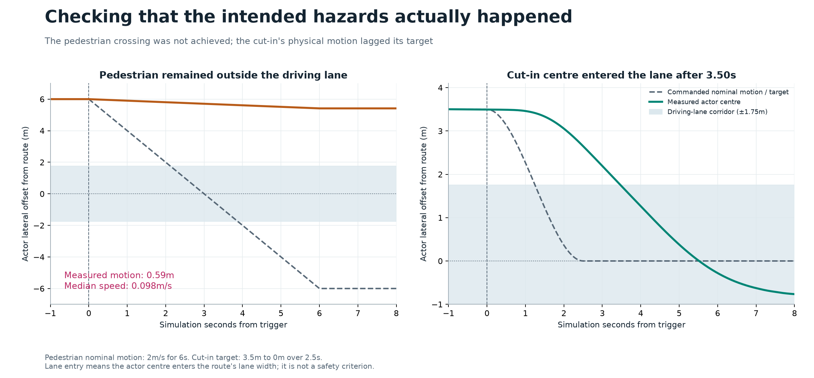
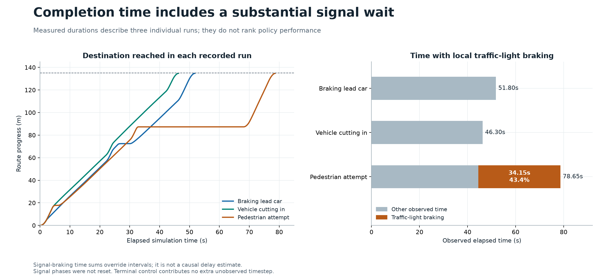
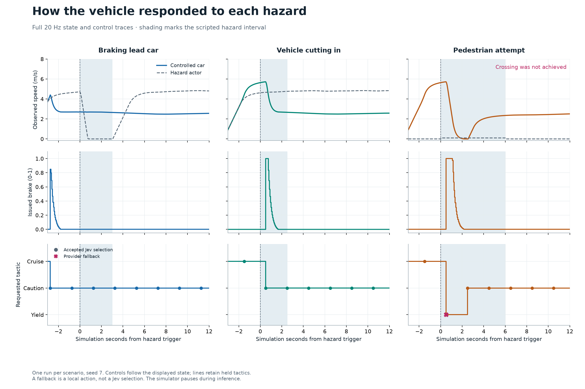
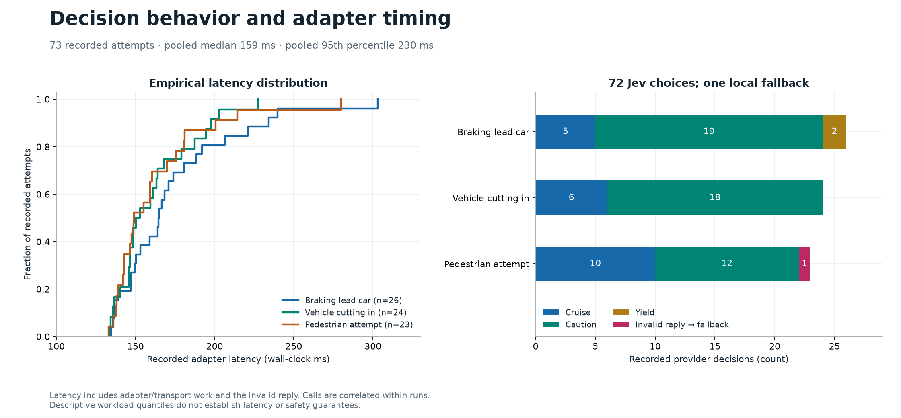
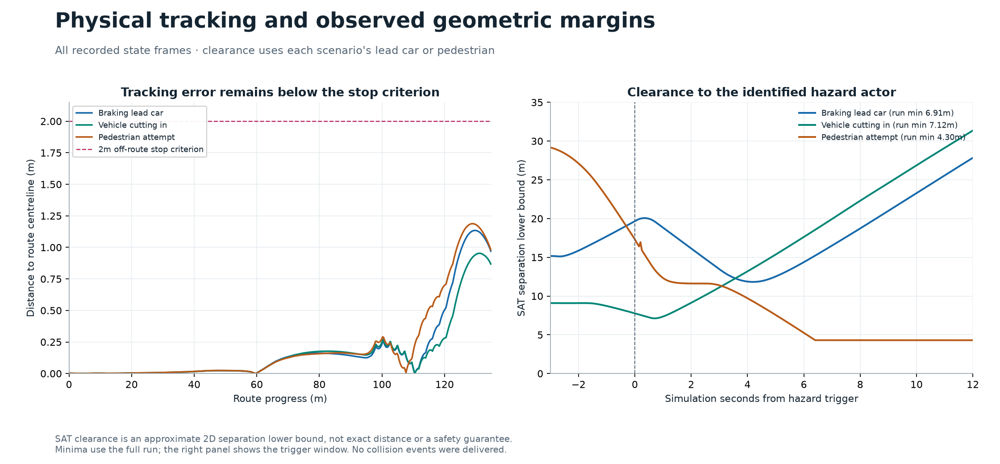
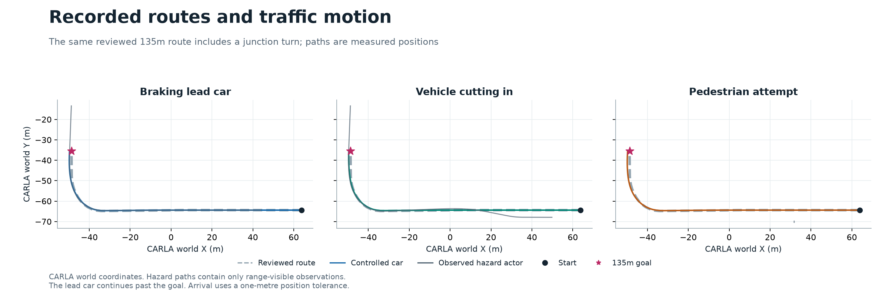

# Jev route study: measured behavior and scenario validity

Six reproducible graphs analyze **3,538 state/control frames and 73 provider
attempts** from the three retained CARLA 0.10.0 / UE5.5 route runs. This is an
offline analysis of existing evidence; it made no new simulator or API calls.

**The intended pedestrian crossing did not happen.** The walker moved only
0.586m during its six-second, 2m/s command and stayed outside the driving lane.
The three controlled cars reached their destinations, but this does not validate
three achieved hazards or pedestrian avoidance. This finding corrects the
earlier interpretation of the [recording](../route-hazards-2026-10-05/README.md).
The runtime defect and missing scenario acceptance checks are tracked in
[issue #96](https://github.com/sidkolapalli/carla-agentic-toolkit/issues/96).

## Did the intended hazards occur?



[Download vector graph](figures/06_scenario_fidelity.svg).

The pedestrian's lateral offset changed from 6.000m to 5.414m from the route
centreline. Its position-derived median speed was 0.097656m/s; the independently
recorded actor velocity agreed. It never entered the lane's ±1.75m corridor.
The nominal 12m movement was not achieved. The cause remains undiagnosed;
these measurements do not identify an upstream CARLA bug.

The cut-in target moved from 3.5m lateral offset to zero over 2.5s. Actual
position lagged: the actor centre first entered the route lane at **+3.50s**,
and its offset at +2.50s was still 2.650m. The lead-braking actor did stop during
its three-second braking command and subsequently resumed. Lane entry here
means actor-centre geometry, not body overlap or a safety threshold.

## Route outcomes and traffic-light effects

| Retained trial | State frames | Elapsed (s) | Stopped (s) | Signal braking (s) | Tracking RMSE (m) | Hazard clearance minimum (m) |
| --- | ---: | ---: | ---: | ---: | ---: | ---: |
| Braking lead car | 1,037 | 51.80 | 3.95 | 0.00 | 0.287 | 6.907 |
| Vehicle cutting in | 927 | 46.30 | 0.30 | 0.00 | 0.256 | 7.120 |
| Pedestrian attempt; crossing unachieved | 1,574 | 78.65 | 36.85 | 34.15 | 0.268 | 4.297 |

All three route outcomes were completed, with zero delivered collision events
and verified restoration of owned actors, sensors and settings. Arrival uses a
one-metre position tolerance and speed below 0.4m/s; final route progress was
about 134.75m against the 135m goal. These outcomes describe the combined Jev
tactics, local controller and guards.



[Download vector graph](figures/02_route_progress.svg).

The pedestrian attempt spent **34.15s, or 43.4% of its elapsed time**, under
local traffic-light braking. Signal phases were observed rather than reset.
This prevents attributing its longer completion time to Jev or the pedestrian.
The stacked bars partition recorded time; they do not estimate how much faster
a counterfactual run without a signal would have been. Stopped time includes
startup, arrival and other stops, and is not identical to signal-braking time.

## Tactical choices and physical response



[Download vector graph](figures/01_hazard_response.svg).

- **Lead braking:** Jev already selected `caution` 0.75s before the trigger.
  The first post-trigger decision, at +1.25s, retained `caution`. The graph does
  not establish that the trigger caused a new Jev response.
- **Cut-in:** Jev changed from `cruise` to `caution` at the first post-trigger
  decision, +0.50s, before the actor centre entered the driving lane.
- **Pedestrian attempt:** the first post-trigger reply, at +0.50s, was invalid.
  Local fallback selected `yield`; Jev selected `caution` at +2.50s. That stop
  is not credited as a successful Jev selection or a validated crossing response.

Decision opportunities normally occur every two simulation seconds. These
offsets combine scheduling and the recorded decisions; they are not model
reaction-time measurements. The simulator pauses during inference. No final
run recorded the local `imminent_obstacle` override.

The pedestrian attempt had 35.70s of held fallback exposure, including expiry
of a held tactic during a signal wait when new requests were suppressed.
There was **one invalid provider reply**, not 35.70s of provider failures.
Signal braking can take priority over the recorded fallback reason.

## Jev workload and measured latency



[Download vector graph](figures/03_decisions_latency.svg).

| Trial | Attempts | Jev cruise / caution / yield | Local provider fallback | Median latency (ms) | p95 latency (ms) |
| --- | ---: | --- | ---: | ---: | ---: |
| Braking lead car | 26 | 5 / 19 / 2 | 0 | 164.7 | 238.3 |
| Vehicle cutting in | 24 | 6 / 18 / 0 | 0 | 151.6 | 202.1 |
| Pedestrian attempt | 23 | 10 / 12 / 0 | 1 | 148.9 | 213.0 |

Across the recorded workload, **72 Jev selections were accepted from 73
attempts**. Pooled latency was **158.8ms median, 230.2ms p95 and 303.0ms
maximum**. Latency is adapter wall time, including transport/local work, and
includes the invalid response. It does not isolate model computation or measure
real-time driving response. The trace retains the invalid-response category,
but not which selection/probability validation failed. No retry replaced it.

Jev selects among supplied tactics using current numerical simulator
observations. Local code steers, tracks speed, brakes for signals and enforces
per-frame limits. The [interface description](../../route-experiments.md)
explains those responsibilities. A fallback can pass the downstream action
validator while its source remains `fallback`; it is excluded from accepted
Jev counts.

## Tracking and geometric clearance



[Download vector graph](figures/04_tracking_clearance.svg).

Maximum route errors were 1.134m, 0.953m and 1.188m respectively, below the
configured 2m off-route stop criterion. That criterion is a harness limit,
not a certification of lane keeping. The largest errors occurred around the
junction turn near the route end.

Hazard-specific clearance minima use the named lead car or walker across the
full run. The plot shows only the trigger window. Clearance is the recorded
2D separating-axis lower bound for padded body boxes, not exact closest-body
distance. The overall traffic minima were about 1.64m because a different,
adjacent vehicle was closer. These measurements must not be interchanged.
The pedestrian remained range-visible for 74.05s of 78.65s; missing later
observations remain null and are not assigned zero clearance.

Forward differences of recorded scalar speed reached approximately −7m/s²
in each run. This supports a follow-up examination of braking smoothness;
it is not a longitudinal-IMU measurement, comfort score or regulatory judgment.



[Download vector graph](figures/05_route_paths.svg). Positions use CARLA world
coordinates and equal spatial scales. Hazard paths stop when outside the
observation range; the lead car can continue beyond the ego destination.

## Method, provenance and limitations

The cohort consists of exactly three final camera-instrumented Jev trials,
one per scenario, seed 7, fixed weather, Town10HD_Opt and a 0.05s fixed step.
Model `jev-1.13.0` and TypeSafe SDK 0.7.2 ran against the official CARLA 0.10.0
Windows server with its matching WSL2 Linux client and the temporary streaming
relay described in the original evidence. The nine setup/calibration records
are retained separately in `trials.json`; they are not a matched control group.

| Scenario identifier | Run ID |
| --- | --- |
| `lead_brake` | `ef40448a56434b63b700274dc72ee7a4` |
| `cut_in` | `e2dfa2af0ca44788a020d2c47cad2fd7` |
| `pedestrian_crossing` (intended label, unachieved) | `787ed3433419402191404e7367f769ee` |

The immutable source [cohort summary](../route-hazards-2026-10-05/summary.json)
has SHA-256 `e4eb0994d6659d62c318ea4b5c2b24c9be7ca0a2e8b424f30dba9972b7bab40a`.
All three runtime package hashes are
`ce471671ddad8b897ade9e28c7aa24086254bcc3072cf738ac36a7eaeaddc5bc`.
The analysis does not modify that runtime, the original video or any raw trace.

[trials.json](trials.json) exports allowlisted numerical observations,
decisions, routes and provenance. Projection checks complete traces, source
hashes, consecutive frame identities, observation/control joins and outcomes
against the retained cohort. Credentials, provider request identifiers and
private storage paths are excluded. [analysis.json](analysis.json) contains
full-precision results and a fingerprint of its exact numerical input.

Durations sum intervals from each sample to the next. The terminal command has
no additional observed interval. Stopped means speed below 0.4m/s. Tracking
RMSE and percentiles use all recorded frames; latency percentiles use linear
interpolation at `(n−1)p`. No smoothing or interpolated state data is added.
Commanded trajectories in the fidelity graph are explicit nominal references.
The generic centreline sign-change field is geometric; it does not by itself
classify a scenario as valid, especially around a curved route.

There is **one driving trial per scenario**. Frames and API calls within each
run are correlated, so their counts cannot serve as independent repetitions.
No significance test, confidence interval, crash probability or causal
rules-versus-Jev advantage is claimed. General traffic, perception, weather
variation, occlusion and real-time inference remain outside this evidence.

The next comparative study should first fix and verify physical scenario
completion, then use paired initial conditions with controlled signal phases,
multiple independent seeds and randomized rules/Jev order. Retain invalid
scenario attempts separately, predefine outcome and fallback measures, and
analyze at the run level. Diagnose the pedestrian with no-key runs before
spending additional provider budget.

## Reproduce without CARLA or a Jev key

From a source checkout, regenerate statistics and graphs into new directories:

```bash
uv run python -m scripts.route_study analyze \
  --input docs/evidence/route-study-2026-10-05/trials.json \
  --output target/reproduced-route-study/analysis.json

cp docs/evidence/route-study-2026-10-05/trials.json target/reproduced-route-study/

uv run --no-project scripts/render_route_study.py \
  --input target/reproduced-route-study \
  --output target/reproduced-route-figures
```

Use `Copy-Item` instead of `cp` in PowerShell. Both scripts refuse to replace
existing outputs. Rendering pins Matplotlib 3.11.2 and NumPy 2.5.3 through
inline script metadata, without adding plotting dependencies to the server.
The retained figures were rendered with Python 3.12.14 on Windows, Agg and
bundled DejaVu Sans. [The manifest](figures/manifest.json) records input, script,
font and output hashes plus software versions. Exact image bytes can differ
across rendering platforms; the numerical results remain independently
recomputable from the committed data.

For maintainers with the original local traces, regenerate the numerical
projection in the source environment:

```bash
python -m scripts.route_study project \
  --input docs/evidence/route-hazards-2026-10-05/summary.json \
  --runs /path/to/saved/runs \
  --output /new/output/trials.json
```

Twelve regression cases cover frame joins, interval accounting, nonfinite and
nonmonotonic time, provider attribution, quantiles and physical hazard checks.
All six raster figures were visually inspected; corresponding SVG exports
preserve vector graphics.

The full isolated Linux quality gate passed **642 Python tests with two expected
skips and nine Rust tests**, plus lint, typing, complexity, formatting and build
checks. Re-projecting the original private traces and recomputing statistics
produced byte-identical `trials.json` and `analysis.json`. Input, output, script
and unchanged runtime hashes and local documentation links were verified.
